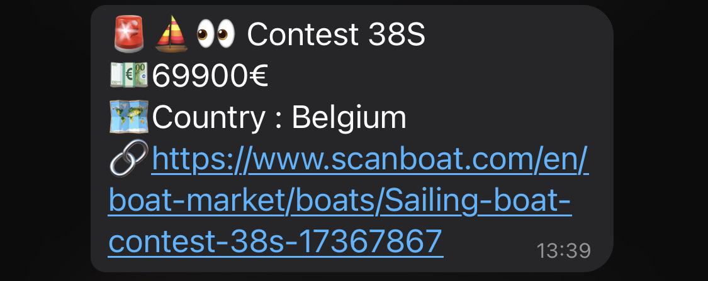
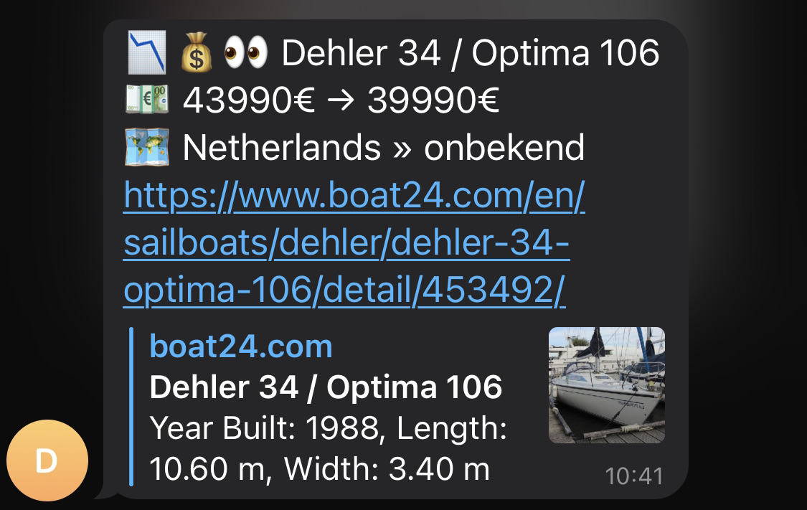
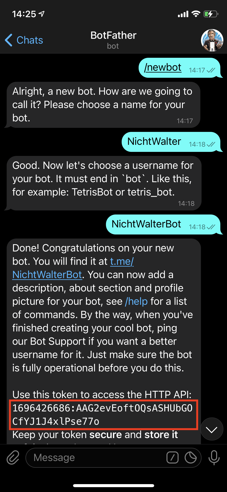
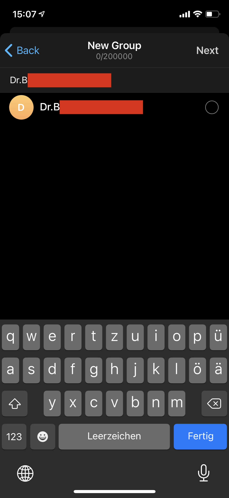
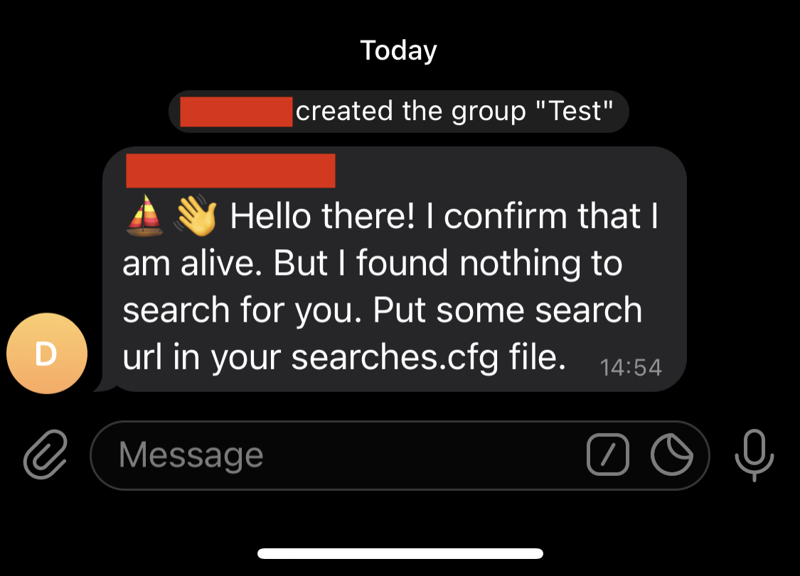

# Dein Boot-Bot

Mit Boatping sparst Du Dir das dauernde Absurfen von Bootsseiten. Suche einfach einmalig was Du brauchst auf einem dieser Portale:

- www.boot24.com
- www.boat24.com
- www.bandofboats.com
- www.scanboat.com

Dann nimmst Du die Url, packst sie in eine Datei, startest **Boatping** - und Du kriegst eine Telegram Nachricht, wenn ein neues Boot auf dem Markt ist.


### Notification: Neues Boot

Wenn Dein Bot ein neues Boot findet, bekommst Du eine Nachricht:



### Notification: Preisänderung

Dein Bot merkt, wenn sich bei einem bekannten Boot der Preis ändern. Dann bekommst Du so eine Nachricht:




# Los gehts

Wir müssen drei Dinge tun:

1. Deinen eigenen Telegram Bot erstellen
2. Deinen Bot in einen Gruppenchat einladen
3. Suchen erstellen


### 1. Deinen Bot erstellen

Geh auf **Telegram** und schreibe eine neue Nachricht an den User **Botfather**. Du brauchst den markierten code (am besten machst Du das am Rechner, mit Telegram web)



Kopier den Code in die Datei ```boatping/memory/bot.cfg```

Die Datei muss so aussehen:

```
23487234678234:AAasdiisdq7ewwqeqwe786
30
```

Die **30** sind die Minuten, die der Bot wartet bis er wieder sucht. Wenn Du die auf **0** schaltest, sucht er nur ein mal.


### 2. Deinen Bot in eine Gruppe einladen

Erstelle auf Telegram eine neue Gruppe. Such Deinen Bot über seinen Namen, und füge ihn zur Gruppe hinzu.




Jetzt kannst Du einmal die boatping.exe starten. Wenn alles geklappt hat, bekommst Du im Gruppenchat eine Nachricht:




### 3. Suchen erstellen

Gehe auf eins dieser Portale:

- www.boot24.com
- www.boat24.com
- www.bandofboats.com
- www.scanboat.com

Und suche, so wie immer, nach Booten. Wenn Du dann die erste Seite mit Ergebnissen siehst, kopier die Url (z.B. https://www.boat24.com/en/sailboats/hallberg-rassy/?src=&cem=&man%5B%5D=4319&whr=EUR&prs_min=10000&prs_max=100000&lge_min=&lge_max=&bre_min=&bre_max=&tie_min=&tie_max=&gew_min=&gew_max=&jhr_min=&jhr_max=&lei_min=&lei_max=&ant=&kie=&per_min=&per_max=&cab_min=&cab_max=&ber_min=&ber_max=&hdr_min=&hdr_max=&sort=rand) in die Datei **boatping/memory/searches.cfg**


Die Datei sollte so aussehen:

```
min-price=0
max-price=59000

# band of boats DE
https://www.bandofboats.com/de/boot-kaufen?ref_nature%5B%5D=sailing_boat&page=1&ref_category%5B%5D=9&country%5B%5D=DE&price_min=20000&price_max=60000&year_min=1970&year_max=&loa_min=10&loa_max=14&beam_min=&beam_max=&horse_power_min=&horse_power_max=

# band of boats NL
https://www.bandofboats.com/de/boot-kaufen?ref_nature%5B%5D=sailing_boat&page=1&ref_category%5B%5D=9&country%5B%5D=NL&price_min=20000&price_max=60000&year_min=1970&year_max=&loa_min=10&loa_max=14beam_min=&beam_max=&horse_power_min=&horse_power_max=

# and so on...
```

Jetzt kannst Du die boatping.exe starten und es sollten Nachrichten hereinkommen.


#### Preis-Einschränkungen

Manche Portale bieten nur eine Preis-Range an, zum Beispiel zwischen 30000 und 50000. Wenn Du aber nur bis 40000€ suchen willst, kannst Du das bei max-price eintragen. **Wichtig: Wenn Du das nicht brauchst, setz einfach für min-price 0 und für max-price eine sehr hohe Zahl ein**


### Logging

Die Datei ```error.log``` enthält Fehler, die Datei ```stats.log``` enthält Statistiken, die nach jedem Suchdurchlauf geschrieben werden. Hier kannst Du ab und zu reinschauen, ob alles gut aussieht.

Beispiel Statistiken:

```
2021-03-07 13:55:45 Search completed. Overall ads 622, new boats 1, price changes 0
2021-03-07 13:55:45   www.bandofboats.com: 167 active ads
2021-03-07 13:55:45   www.scanboat.com: 237 active ads
2021-03-07 13:55:45   www.boat24.de: 103 active ads
2021-03-07 13:55:45   www.boot24.de: 115 active ads
2021-03-07 14:15:59 Search completed. Overall ads 622, new boats 0, price changes 0
2021-03-07 14:15:59   www.bandofboats.com: 167 active ads
2021-03-07 14:15:59   www.scanboat.com: 237 active ads
2021-03-07 14:15:59   www.boat24.de: 103 active ads
2021-03-07 14:15:59   www.boot24.de: 115 active ads
```

